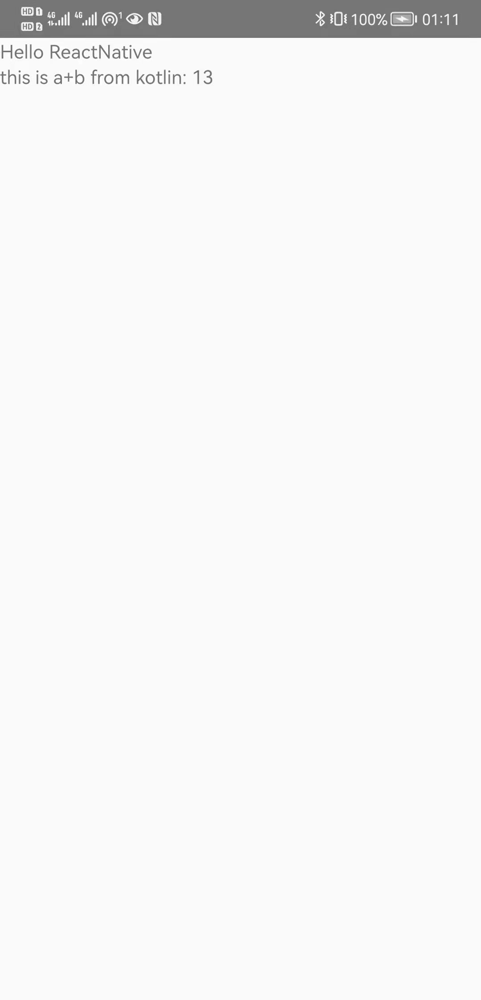

# React Native & Kotlin

Write Native Modules for React Native in Kotlin.

> React Native 0.67 (2022.3.3)

## Procedures

- `kotlin` calculate `a+b`
  - the `a+b` is written in `AlertManager.kt` -> `fun trigger(a:Double, b:Double, resPromise:Promise)`
- `react-native` display the result
  - have to use `async&await` to get the result

### 1 set up a react-native project

Follow [this guide](https://reactnative.dev/docs/environment-setup)

`npx react-native init RNwithKotlin`

### 2 Use **Android Studio** to open the `android` folder

#### 2.1 `android/build.gradle`

```
buildscript {
  //== add 1. ==
  ext.kotlin_version = "1.4.32"
  ...
  repositories {
    ...
    //== add 2. ==
    maven { url 'https://dl.bintray.com/kotlin/kotlin-eap' }
  }
  dependencies {
    ...
    //== add 3. ==
    classpath "org.jetbrains.kotlin:kotlin-gradle-plugin:$kotlin_version"
  }
}

allprojects {
  repositories {
    ...
    //== add 4. ==
    jcenter()
    maven { url 'https://www.jitpack.io' }
  }
}
```

#### 2.2 `android/app/build.gradle`

```
/**============ add here ===============*/
apply plugin: "kotlin-android"

...

android {
  ...
//============== add here =======================
  buildFeatures {
    viewBinding true
  }
}

dependencies {
  ...
//============== add here =======================
  implementation "org.jetbrains.kotlin:kotlin-stdlib"
  ...
}
```

#### 2.3 `aplusb.kt`

```
package com.rnwithkotlin

import android.view.View
import com.facebook.react.ReactPackage
import com.facebook.react.bridge.NativeModule
import com.facebook.react.bridge.ReactApplicationContext
import com.facebook.react.uimanager.ViewManager
import java.util.*

class AplusB:ReactPackage {
    override fun createNativeModules(reactContext: ReactApplicationContext): List<NativeModule> {
        val modules = ArrayList<NativeModule>()
        modules.add(AlertManager(reactContext))
        return modules
    }

    override fun createViewManagers(reactContext: ReactApplicationContext): List<ViewManager<*, *>> {
        return Collections.emptyList<ViewManager<*, *>>()
    }
}
```

#### 2.4 `AlertManager.kt`

```
package com.rnwithkotlin

import android.content.Intent
import com.facebook.react.bridge.ReactApplicationContext
import com.facebook.react.bridge.ReactContextBaseJavaModule
import com.facebook.react.bridge.ReactMethod
import com.facebook.react.bridge.Promise;

class AlertManager(reactContext: ReactApplicationContext) : ReactContextBaseJavaModule(reactContext) {
    private final var TAG = "AlertMangager";
    override fun getName(): String {
        return "Alt"
    }

    @ReactMethod
    //=========== a+b here ===============
    // have to use promise to get the result async.
    fun trigger(a:Double, b:Double, resPromise:Promise) {
        resPromise.resolve(a+b);
    }

}
```

#### 2.5 `MainApplication.java`

```
@Override
protected List<ReactPackage> getPackages() {
  @SuppressWarnings("UnnecessaryLocalVariable")
  List<ReactPackage> packages = new PackageList(this).getPackages();

//============================= add here ===============================
  packages.add(new AplusB());

  // Packages that cannot be autolinked yet can be added manually here, for example:
  // packages.add(new MyReactNativePackage());
  return packages;
}
```

### 3 export the module

in `kotlin.js`:

```js
import {NativeModules} from 'react-native';
const {Alt} = NativeModules;
console.log('Alt: ', Alt);
export default Alt;
```

> we can use `Alt.trigger(a,b)` now.
> For Example, in `App.js`:
>
> ```js
> import React from 'react';
> import {View, Text} from 'react-native';
> import Alt from './kotlin';
>
> export default class App extends React.Component {
>   state = {res: 0};
>
>   async componentDidMount() {
>     let tmp = await Alt.trigger(10, 3); // test value here!
>     console.log(tmp);
>     this.setState({res: tmp});
>   }
>
>   render() {
>     return (
>       <View>
>         <Text>Hello ReactNative</Text>
>         <Text>this is a+b from kotlin: {this.state.res}</Text>
>       </View>
>     );
>   }
> }
> ```

### 4 result

`npx react-native run-android`


